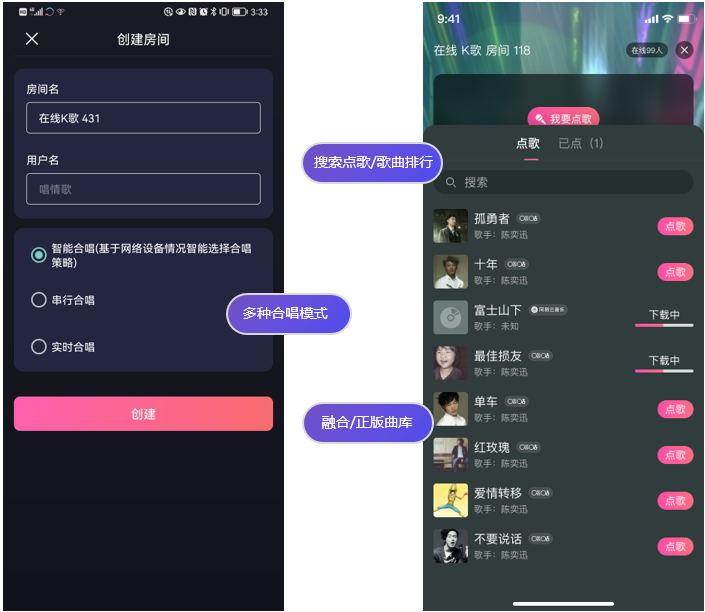
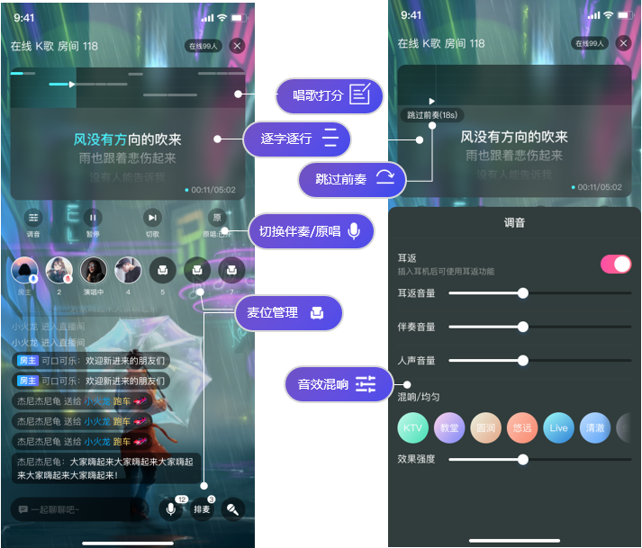

# NEKaraoke

# 简介
在线 K 歌是娱乐社交场景中的新型互动玩法， 在基础的直播、多人语聊、PK 连麦等场景下都可以加入趣味十足的 K 歌场景。观众可直接参与 K 歌，增强直播间的互动性，活跃直播间的氛围，提升用户的停留时长。通过打赏模式增强商业转化。

# 功能列表

## 点歌
网易云信在线 K 歌 场景融合网易云音乐和咪咕的版权音乐，用户上麦后可以通过搜索歌曲或默认推荐进行点歌，普通观众不能点歌。
另外，点歌台还支持切歌、查看已点歌曲列表、删除已点歌曲、歌曲下载、暂停和播放歌曲。

## K 歌
K 歌按场景分为独唱和合唱。除了基础的 K 歌功能，还支持多种能力，包括：

|  主要功能   | 功能描述  |
|  ----  | ----  |
|原唱伴奏切换|歌曲一键切换原唱、伴奏|
|前奏跳过|跳过歌曲前奏直接开场，适配 5s 等待时间|
|歌曲评分|根据每句演唱水平进行打分，整首歌曲结束后也可全歌曲评分|
|逐字歌词|根据进度逐字展示当前歌曲已唱到的部分|
|麦位管理|包括：上麦、下麦、麦位禁言、锁麦、强制下麦、设置房间内麦位数，麦上才能唱歌|
|音效混响|耳返、音量、混响等功能帮助演唱者获得更好的演唱体验|

# 效果演示

> 您可以扫描下方二维码，下载并体验demo。

| iOS    | Android  |
|  ----  | ----  |
|   |   | 

在线 KTV Demo 的界面效果图如下所示：

# 联系我们

- 如果想要了解该场景的更多信息，请参见[在线 K 歌场景方案文档](https://doc.yunxin.163.com/karaoke/docs/home-page?platform=android)
- 完整的API文档请参见[API参考](https://doc.yunxin.163.com/karaoke/api-refer)
- 如果您遇到的问题，可以先查阅[知识库](https://faq.yunxin.163.com/kb/main/#/)
- 如果需要售后技术支持，请[提交工单](https://app.yunxin.163.com/index#/issue/submit)  

# 更多场景方案
网易云信针对1V1娱乐社交、语聊房、PK连麦、在线教育等业务场景，推出了一体式、可扩展、功能业务融合的全链路解决方案，帮助客户快速接入、业务及时上线，提高营收增长。
- [1对1 娱乐社交](https://github.com/netease-kit/1V1)
- [语聊房](https://github.com/netease-kit/NEChatroom)
- [PK连麦](https://github.com/netease-kit/OnlinePK)
- [在线教育](https://github.com/netease-kit/WisdomEducation)
- [多人视频通话](https://github.com/netease-kit/NEGroupCall)
- [一起听](https://github.com/netease-kit/NEListenTogether)
- [云信娱乐社交服务端 Nemo](https://github.com/netease-kit/nemo)
